# THE BOSS

The Boss is a web application that provides user registration, login, and profile functionalities in both `dark` and `light` theme (system default ).

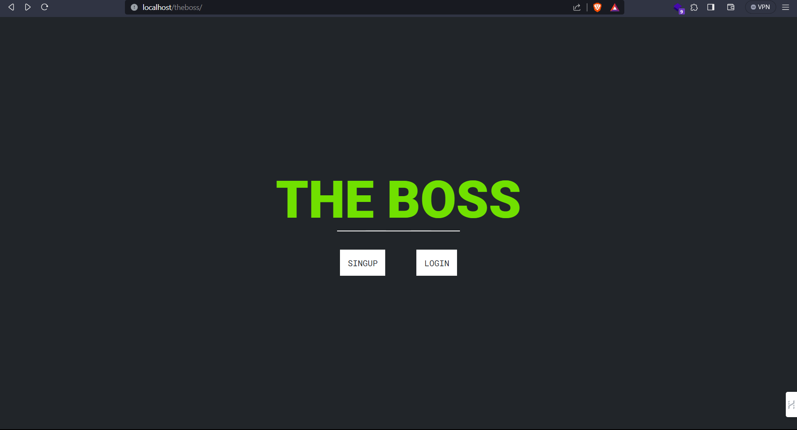

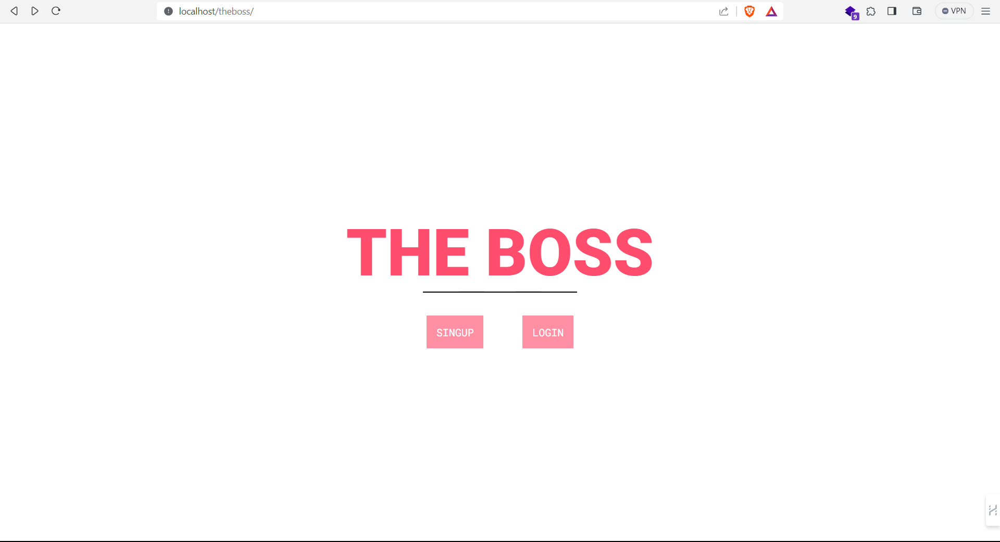

## Technologies Used

- Frontend: `HTML`, `CSS`, `JavaScript`, `jQuery`
- Backend: `PHP`, `MongoDB` and `MySQL` for user data storage, `Redis` for session management

## Features

### 1. USER REGISTRATION

To register a new user, the following steps are taken:

- **Frontend:** HTML form to collect user registration information (e.g., username, email, password).
- **Backend:**

  - Validate user input.
  - Hash the password using PHP's `password_hash` function.
  - Store user information in the MySQL as well as MongoDB database.

  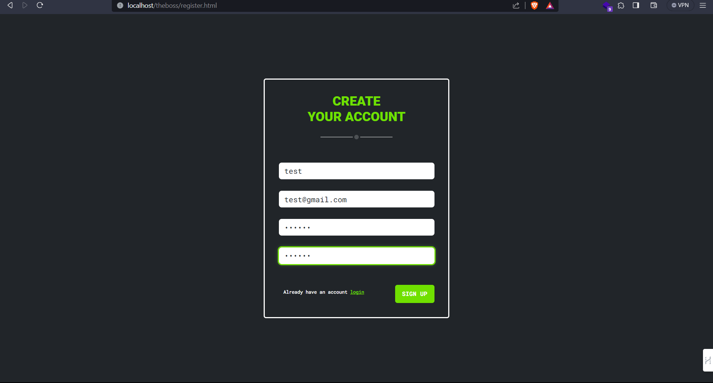

  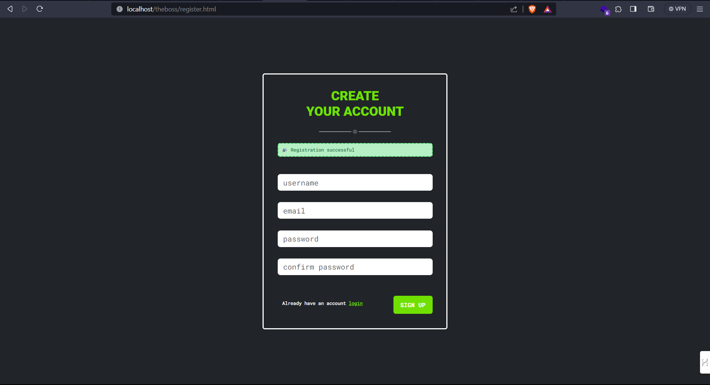

  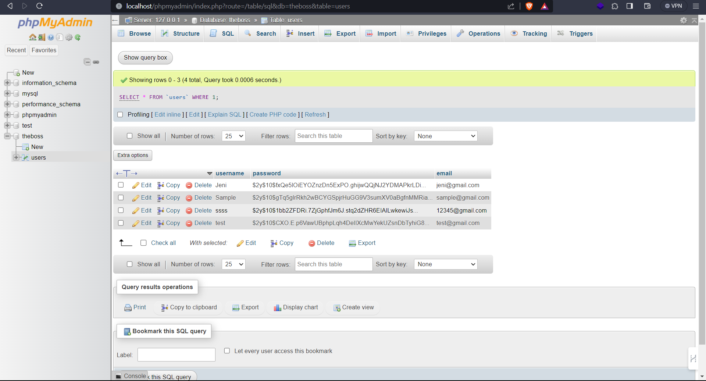

  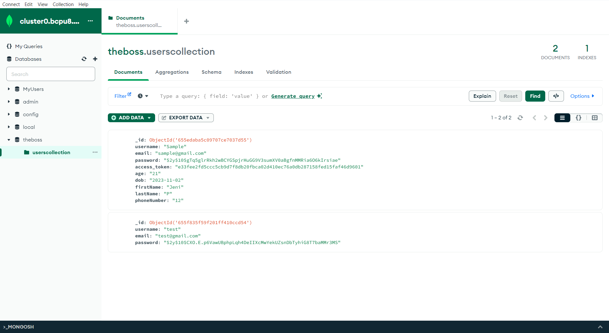

### 2. USER LOGIN

Users can log in to the application using the following process:

- **Frontend:** HTML form to collect login credentials (e.g., username/email and password).

- **Backend:**

  - Retrieve user information from MongoDB based on the provided username/email.
  - Verify the password using PHP's `password_verify` function.
  - If authentication is successful, generate an access token, store it in MongoDB, and return it to the client. The access token ( random string ) will be stored in redis and username will be stored in `localstorage`

    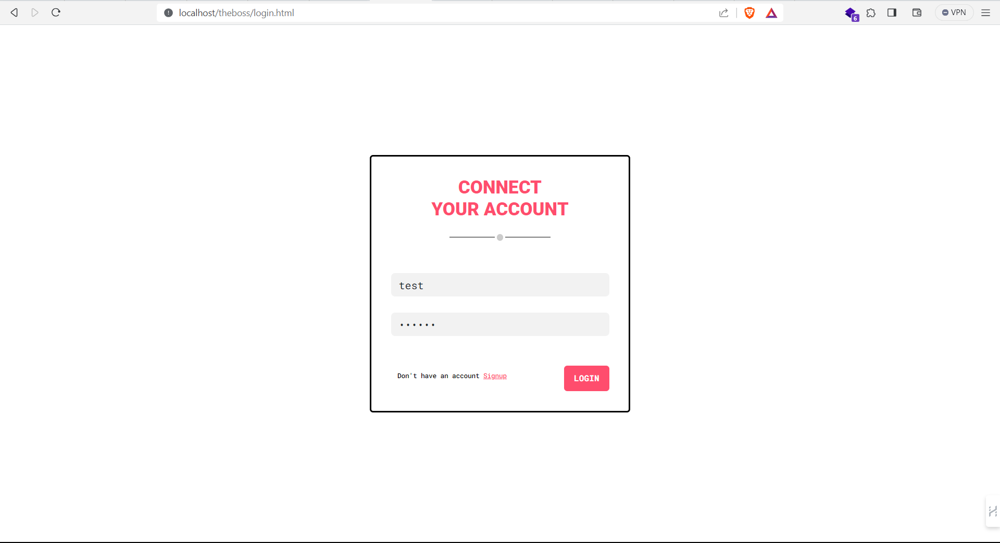

    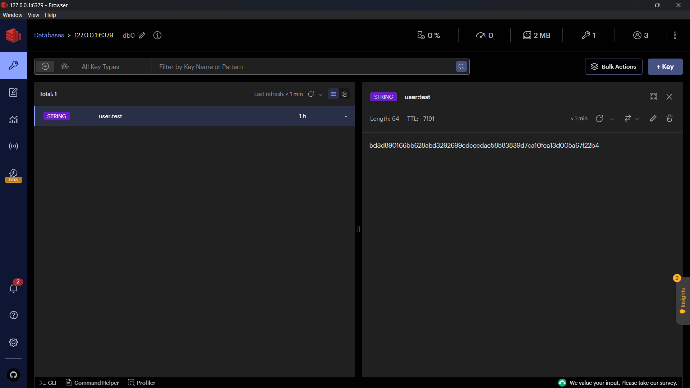

### 3. USER PROFILE

The user profile page displays the user's details:

- **Frontend:** HTML page to display the user's profile information.

- **Backend:**
  - Check for the presence of a valid access token in the redis using browser's local storage values.
  - If the token is valid, fetch the user's details from MongoDB.
  - Display the user's details on the profile page.

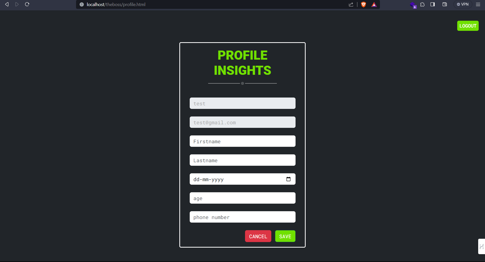

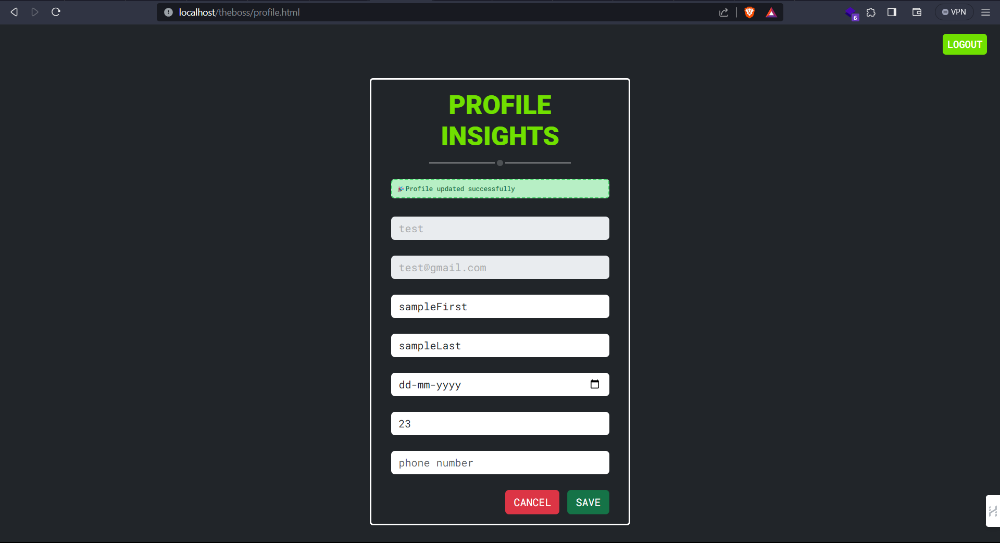

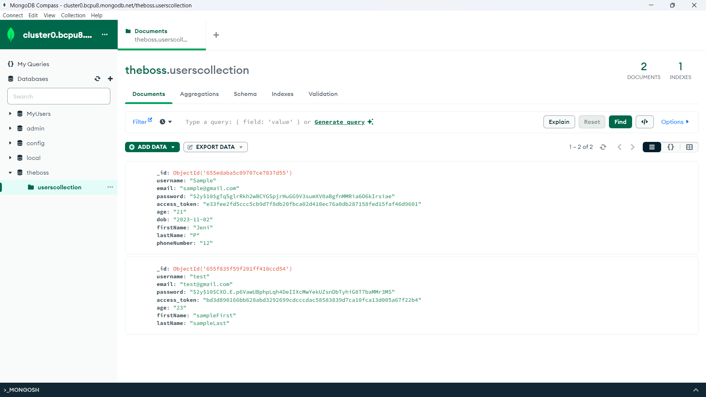

### 4. SESSION MANAGEMENT WITH REDIS

- Use Redis to store session information, including the username and access token.
- When a user logs in, store their access token in Redis with an expiration time.
- Use Redis to check the existence of a user's session before processing certain requests (e.g., profile access).

### before logging out

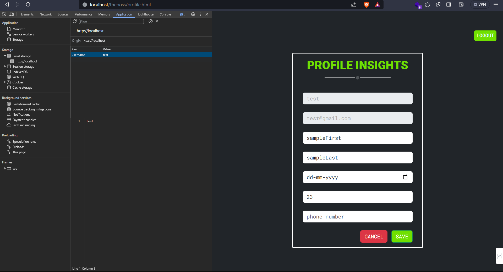

### after logging out

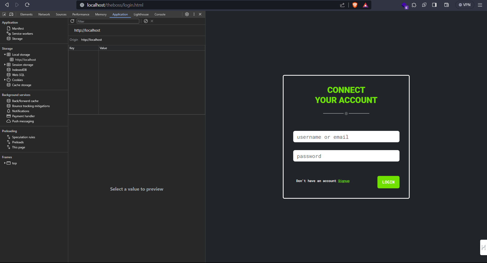

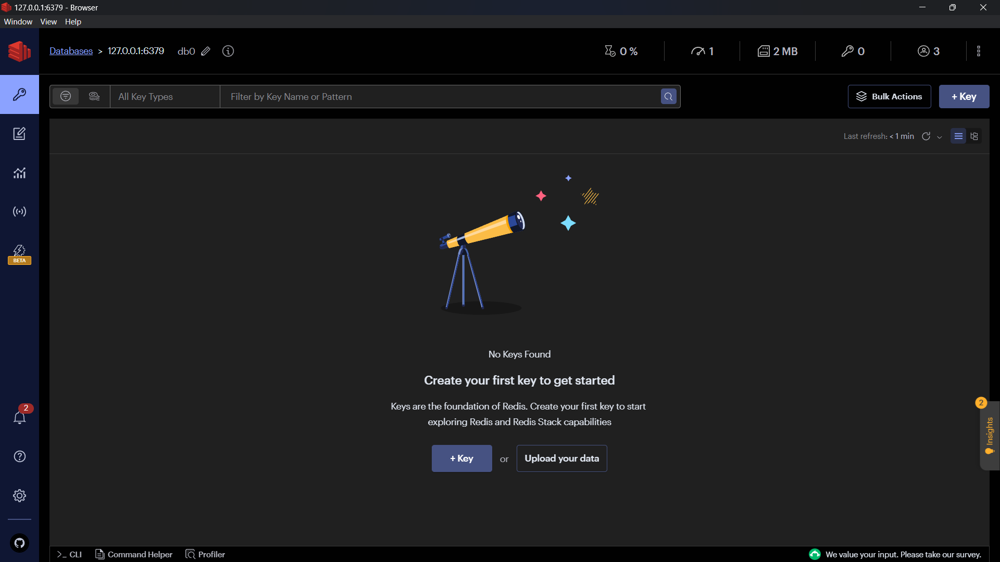
